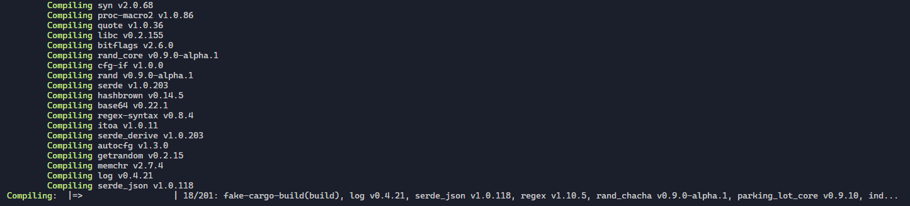

## Fake cargo build or run (what you prefer, lol)


Why? Cuz i want it <br>
Anyway, it is just a reference to [ExtremeCode](https://www.youtube.com/@ExtremeCode) infinity react project setup

## How to use
1. Build it ```cargo build --release```
2. Wait while it compiles
3. Still wait...
4. Wait...
5. Still wait
6. And it's done.
7. Add executable to PATH or just move to the target directory
8. 
    ```bash 
    alias cargo='fake-cargo-build'
    cargo build
    # Profit 🚀🚀🚀🚀🚀
    ```